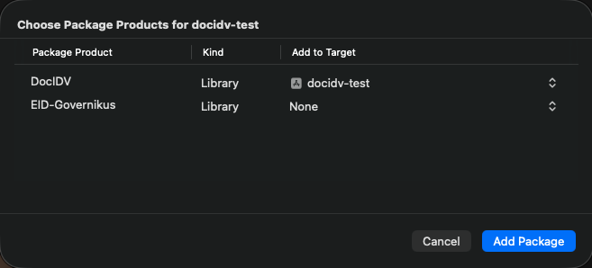

# DocIDV - IDnow

[](https://developer.apple.com/ios/)
[](https://developer.apple.com/swift/)
[](https://developer.apple.com/swift/)
[](https://img.shields.io/badge/Swift_Package_Manager-compatible-orange)

## Table of Contents

- [About](#about)
- [Key Features](#key-features)
- [Requirements](#requirements)
- [Installation](#installation)
- [Integration](#integration)
  - [Starting the SDK](#starting-the-sdk)
  - [Handling errors](#handling-errors)
- [Additional Features](#additional-features)

## About
Welcome to the IDnow DocIDV project. This repository provides the official Swift Package for the DocIDV iOS SDK, which enables you to capture identity documents using the device's camera, performing several security checks and offering various other features.

The DocIDV framework incorporates the IDnow platform into your iOS app. We offer two SDK variants as xcframeworks: one with the bank transfer feature (XS2A) and one without.

- **DocIDV**: The SDK without the bank transfer functionality.
- **DocIDV-with-XS2A**: The SDK including the bank transfer functionality.

This guide provides detailed instructions on how to install, set up, and integrate the SDK.

## Key Features

* **OCR**: Identity document capture.
* **OTP**: Phone number verification.
* **Liveness**: Liveness check for a secure flow.
* **NFC**: NFC chip scanning.
* And many other features!

## Requirements

* **Minimum deployment version:** iOS 14.0.
* **Swift:** 5.0.
* **NFC:** An NFC-enabled iPhone (iPhone 7 or newer models).

## Installation

Follow these steps to integrate the DocIDV library into your application.

### Import SDK

The DocIDV SDK is available exclusively through Swift Package Manager (SPM).
1. Copy the official SPM repository URL: `https://github.com/idnow/docidv-sdk-ios`
2. In Xcode, navigate to `File` > `Add Package Dependencies...` and paste the URL.
3. Choose the desired package version. We recommend selecting "Up to Next Major Version" to receive compatible updates automatically. Click `Add Package`.
4. Add to your application's target `DocIDV` Package Product.
5. Add additional features you need. Example, if you need eID, add `EID-Governikus` to your application's target.

Here is how it will look in Xcode:



6. Click `Add Package`.

📥 DocIDV is now imported into your project.
Note that Xcode has also imported several other libraries that our SDK depends on. You will find them in the `Package Dependencies` list in the Project Navigator.

### Configure Your App

To use our SDK, you need to configure your project to allow the use of the camera and NFC.

#### Entitlements File

1. Open your entitlements file (If you don't already have one, File > New File > Property List, and name it, e.g., `YourApp.entitlements`).
2. Add a new key `Near Field Communication Tag Reader Session Formats` of type `Array`.
3. In this array, add an item:
    - key: `Item 0 (Near Field Communication Tag Reading Session Format)`
    - value: `Tag-Specific Data Protocol (TAG)`

#### Info.plist File

1. Open your main `Info.plist` file.
2. Add a new key `ISO7816 application identifiers for NFC Tag Reader Session` of type `Array`.
3. Add the following two strings to this array:
   - `A00000045645444C2D3031`
   - `A0000002471001`
4. Add an entry for `Privacy - NFC Scan Usage Description` that describes why your app needs to use NFC.
5. Add an entry for `Privacy - Camera Usage Description` that describes why your app needs to use the camera.
6. Add an entry for `Privacy - Photo Library Usage Description` that describes why your app needs to store photos on the device.
7. If you use the video call feature, please add `Privacy - Microphone Usage Description` that describes the use of the microphone for calls with an agent.

👏 You are now ready to integrate the DocIDV SDK.

## Integration
### Starting the SDK
Here is an example of how to launch the SDK from your host app:

```swift
func startDocIDV() async {
  do {
    try await IDnowDocIDV.shared.start(token: token,
                                       isRoutedSession: isRoutedSession,
                                       preferredLanguage: preferredLanguage,
                                       viewController: viewController,
                                       bindingKey: bindingKey)
    // Handle success
  } catch let error {
    // Handle errors
  }
}
```
This code calls the main `start` method to launch the DocIDV library. It takes several parameters:

| Parameter | Type | Description |
|---|---|---|
| `token` | `String` | The identification token provided for the session. |
| `isRoutedSession` | `Bool` | Boolean which can be set by customers to allow resuming an ident that was started from another side. |
| `preferredLanguage` | `String` | The preferred language code for the SDK, e.g., `"fr"`. Defaults to English (`"en"`) if not specified. |
| `viewController` | `UIViewController` | The view controller that will present the SDK. It is also used to determine the appearance mode (light/dark) from your app. |
| `bindingKey` | `String` | Used for device binding use cases. It helps establish a correlation between a user's verified identity and their mobile device. This is particularly useful for device authentication and re-authentication scenarios. The `bindingKey` for a completed identification can be fetched via an API endpoint and compared with the one used during SDK initialization. |


### Handling errors

In case of an error, the `start` method will throw the error. The error is an `IDnowDocIDVError`. Here is an enum describing each case:
```swift
public enum IDnowDocIDVError: Error {
    case cancelled(reason: AbortReason, message: String)
    case token(error: TokenError, message: String)
    case network(error: NetworkError, message: String)
    case internalError(code: Int, message: String)
}
```

#### Handling Specific Errors
##### Token errors
```swift
public enum TokenError {
    case formatError
    case notFound
    case expiredOrDeleted
    case alreadyCompleted
    case viToken
}
```
*   For `expiredOrDeleted`, it is recommended to request a new identification token and restart the process.
*   For `alreadyCompleted`, it is recommended to inform the user that they have already submitted all required information and should wait for the final result.

##### Timeout
*   For the internal error with a `170` code (Timeout), it is recommended to notify the user that the session timed out or was started on a different device and ask them to try again.

##### Other errors
*   For all other error codes, it is recommended to show a generic error message and ask the user to try restarting the process.

🎉 That's it! DocIDV can now be launched from your host app.

## Additional Features
### Dark Mode
Each screen of the SDK natively supports dark mode. It automatically adopts your app's appearance settings (light, dark, or system default).

### Localization
The SDK supports multiple languages (ISO 639-1). The list of supported languages is provided below:
* Arabic
* Bulgarian
* Croatian
* Czech
* Danish
* Dutch
* English
* Estonian
* Finnish
* French
* German
* Gujarati
* Hungarian
* Italian
* Polish
* Portuguese
* Punjabi
* Romanian
* Russian
* Serbian
* Slovak
* Spanish
* Swedish
* Turkish
* Ukrainian
